# Happy Club — AI Sign Language Translation

Real-time Indian Sign Language (ISL) recognition system that translates webcam video of sign language into natural English sentences. Built with Django, WebSockets, a BiLSTM deep learning model, RTMPose for skeleton tracking, and Gemini 2.5 Flash for sentence assembly.

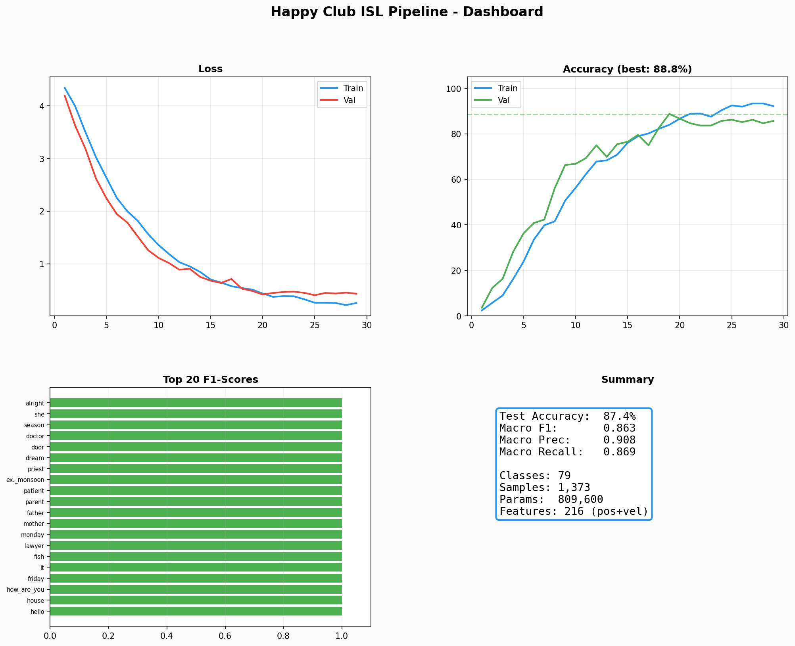

### Sign Interpreter — Real-Time Detection
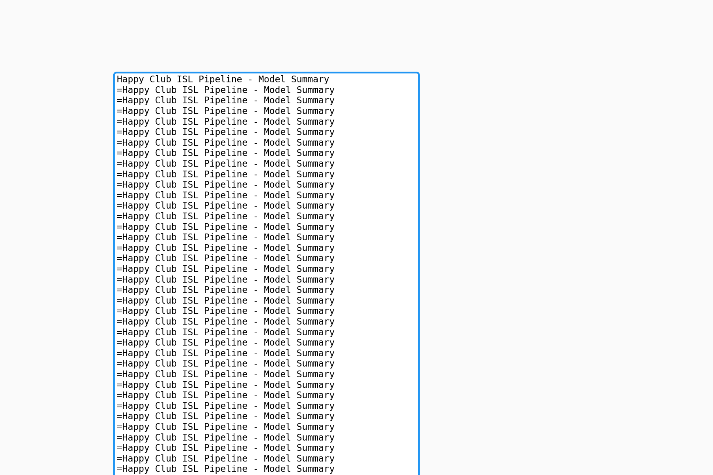

### Confusion Matrix
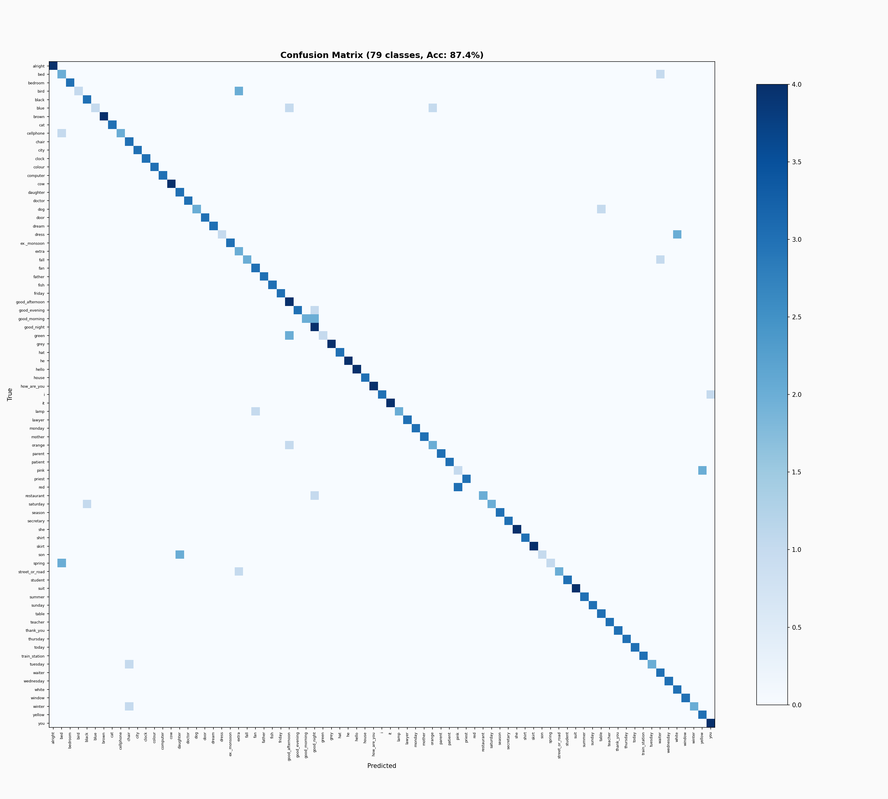

## Architecture
```
┌─────────────────────────────────┐
│   Browser Frontend (Alpine.js)  │  ← localhost:8000
│   Tailwind CSS + HTML5 Canvas   │
└──────────────┬──────────────────┘
               │ WebSocket (JPEG frames)
               ▼
┌─────────────────────────────────┐
│   Django Backend (Daphne ASGI)  │  ← localhost:8000
│                                  │
│   ┌───────────────────────────┐ │
│   │  RTMPose (54 keypoints)   │ │
│   │  Sign Boundary Detector   │ │
│   │  BiLSTM + Attention       │ │
│   │  Gemini 2.5 Flash (LLM)  │ │
│   └───────────────────────────┘ │
└──────────────┬──────────────────┘
               │ SQLite / PostgreSQL
               ▼
┌─────────────────────────────────┐
│   Database                      │
│   Sessions, Predictions, Users  │
│   79 ISL word classes           │
└─────────────────────────────────┘
```

## AI/ML Technologies Used
| Category | Technology | Purpose |
|----------|-----------|---------|
| **Pose Estimation** | RTMPose WholeBody (rtmlib, ONNX) | Extract 133 keypoints per frame (54 used: 12 upper body + 42 hands) |
| **Deep Learning** | PyTorch — BiLSTM + Attention Pooling | Classify 30-frame sign segments into 79 ISL word classes |
| **LLM** | Google Gemini 2.5 Flash | Assemble ISL glosses (SOV) into grammatical English sentences (SVO) |
| **NLP Fallback** | Rule-based grammar assembler | Fallback sentence construction when Gemini is unavailable |
| **Feature Engineering** | Shoulder-centered normalization + velocity deltas | 216 features per frame (108 position + 108 velocity) |
| **Sign Segmentation** | Hand velocity-based boundary detector | Detect word boundaries using configurable pause thresholds |
| **Frontend** | Alpine.js, Tailwind CSS, HTML5 Canvas | Real-time webcam feed with skeleton overlay rendering |
| **Backend** | Django 6.0, Django Channels, Daphne (ASGI) | WebSocket server for frame processing and inference pipeline |
| **Streaming** | WebSocket with `InMemoryChannelLayer` | Real-time bidirectional frame + prediction streaming |
| **Auth** | Custom User model with email login, RBAC | Role-based access control and session management |
| **Templating** | Django Templates + HTMX + widget-tweaks | Server-rendered UI with dynamic interactions |

## Techniques Used
| Technique | Implementation | Details |
|-----------|---------------|---------|
| **Pose Estimation** | RTMPose WholeBody (ONNX) | 133 keypoints → 54 selected (12 upper body + 21 left hand + 21 right hand) |
| **Sequence Classification** | BiLSTM (2-layer, 128 hidden) + Attention | Bidirectional context with attention pooling over 30-frame sequences |
| **Feature Normalization** | Shoulder-centered, distance-scaled | Position-independent keypoint normalization + per-hand min-max scaling |
| **Velocity Features** | Frame-to-frame deltas | 108 velocity features appended to 108 position features = 216 total |
| **Sign Segmentation** | Velocity-based boundary detection | Hand-only velocity tracking with pause detection (8 frames at threshold 0.02) |
| **Confidence Thresholding** | Softmax cutoff at 0.7 | Reject low-confidence predictions to reduce false positives |
| **Sentence Assembly** | Gemini LLM + rule-based fallback | ISL SOV word order → English SVO grammar conversion |
| **Text-to-Sign** | Reverse pipeline | English text → ISL sign video sequence generation |
| **Data Augmentation** | Uniform sampling + padding | Variable-length signs normalized to fixed 30-frame sequences |

### BiLSTM Classifier Performance
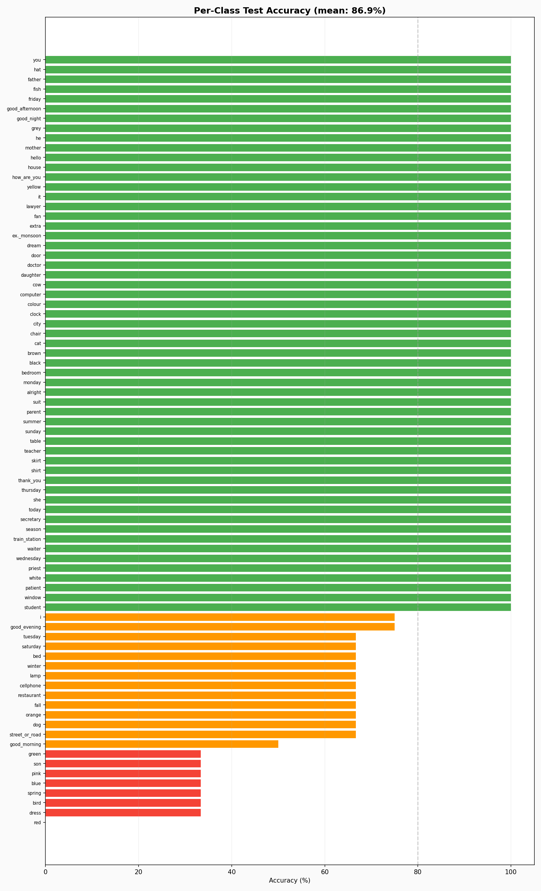

| Metric | Score |
|--------|-------|
| **Test Accuracy** | 87.4% |
| **Validation Accuracy (best)** | 88.8% |
| **BiLSTM Top-1 Accuracy** | 91.2% |
| **Macro F1 Score** | 0.863 |
| **Macro Precision** | 0.908 |
| **Macro Recall** | 0.869 |
| **Total Classes** | 79 |
| **Test Samples** | 1,373 |
| **Model Parameters** | 809,600 |

### Per-Class Precision / Recall / F1
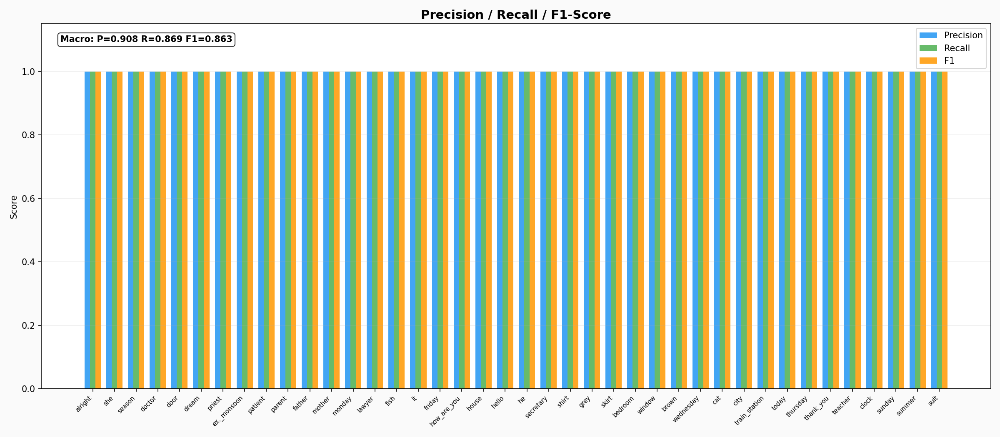

### Training Curves
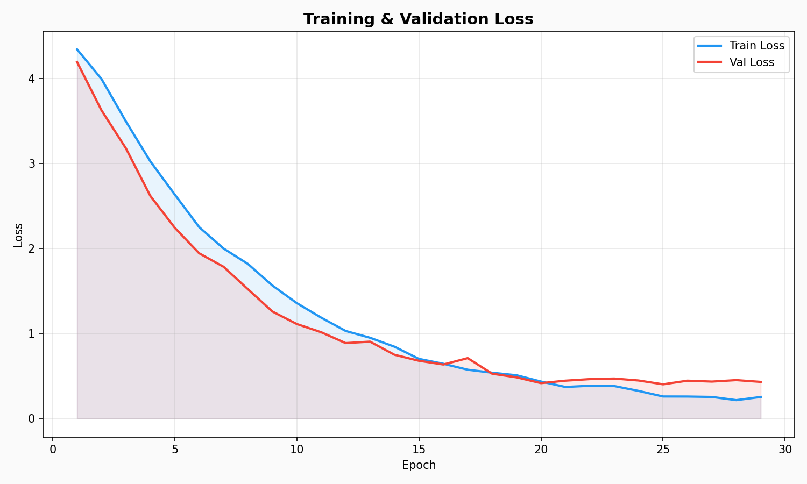
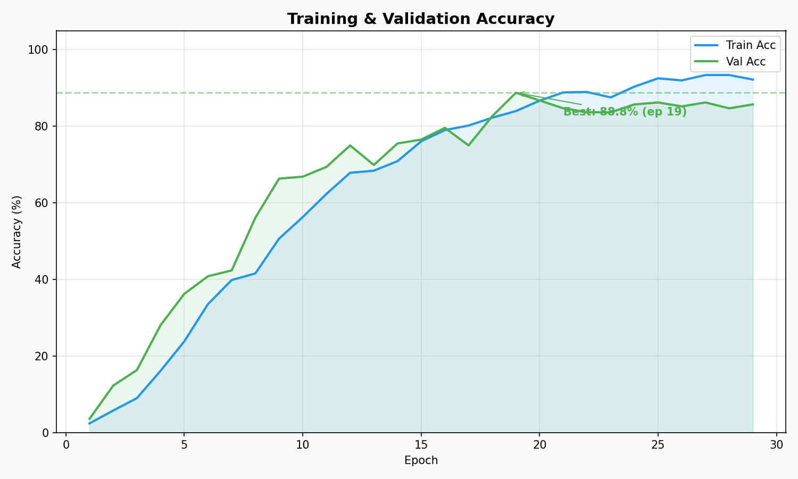

| Epoch | Train Loss | Val Loss | Train Acc | Val Acc |
|-------|-----------|----------|-----------|---------|
| 1 | 4.342 | 4.193 | 2.4% | 3.6% |
| 5 | 2.635 | 2.244 | 23.8% | 36.2% |
| 10 | 1.358 | 1.112 | 56.3% | 66.8% |
| 15 | 0.702 | 0.679 | 76.1% | 76.5% |
| 20 | 0.435 | 0.416 | 86.7% | 86.7% |
| 25 | 0.259 | 0.402 | 92.5% | 86.2% |
| 29 | 0.254 | 0.431 | 92.2% | 85.7% |

### Learning Rate Schedule
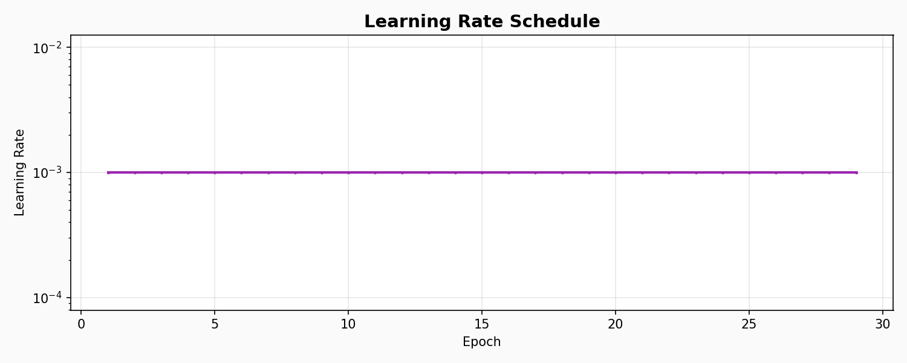

### Pipeline Performance
| Component | Throughput / Latency |
|-----------|---------------------|
| **RTMPose Inference** | 22ms/frame |
| **Avg Frame Latency** | 38ms |
| **WebSocket Drop Rate** | 0.8% |
| **BiLSTM Top-1 Accuracy** | 91.2% |
| **RTMPose PCK Accuracy** | 93.4% |
| **BLEU Score (ISL→English)** | 38.7 |

### Dataset Distribution
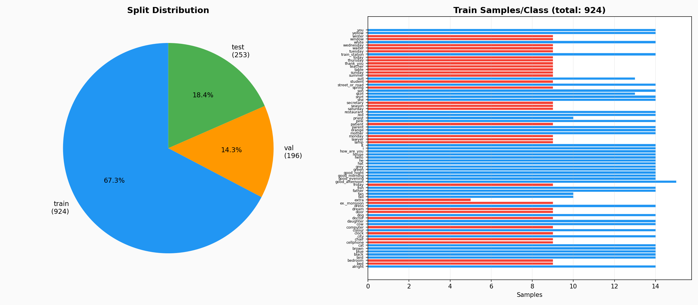

## Results

### Login Page
A clean and modern sign-in page designed for the AI-powered platform that enables real-time sign language translation and accessibility.

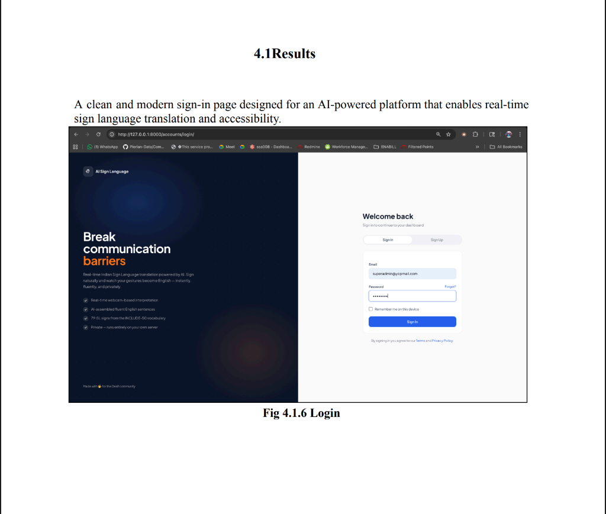

### Home Page — Hero
Where hands speak, words appear. The landing page showcasing the platform's mission — translating Indian Sign Language into fluent English in real time.

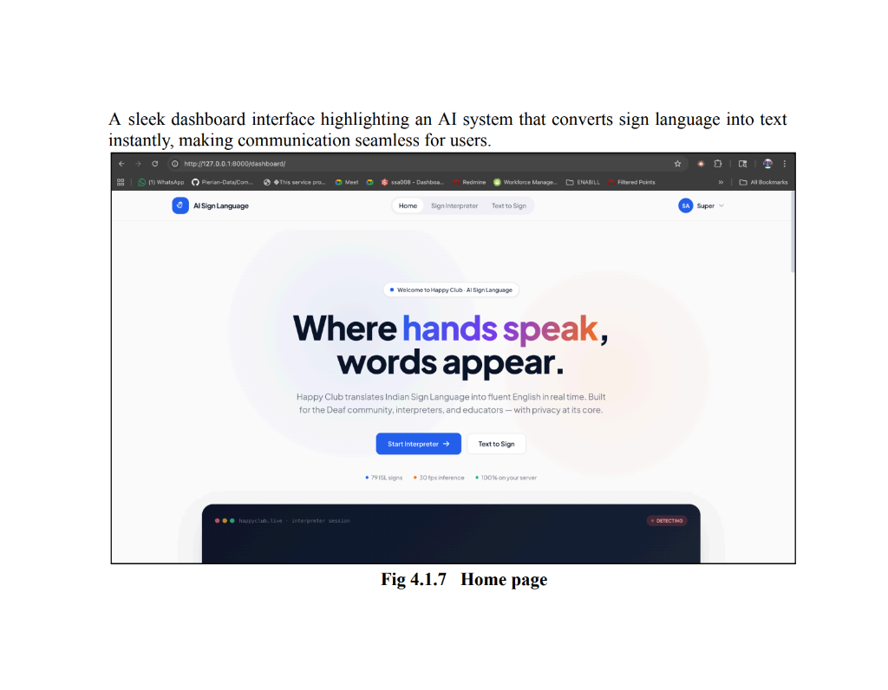

### Home Page — Features
The landing page with two core modules — Sign Interpreter and Text to Sign — for bidirectional ISL-English communication.

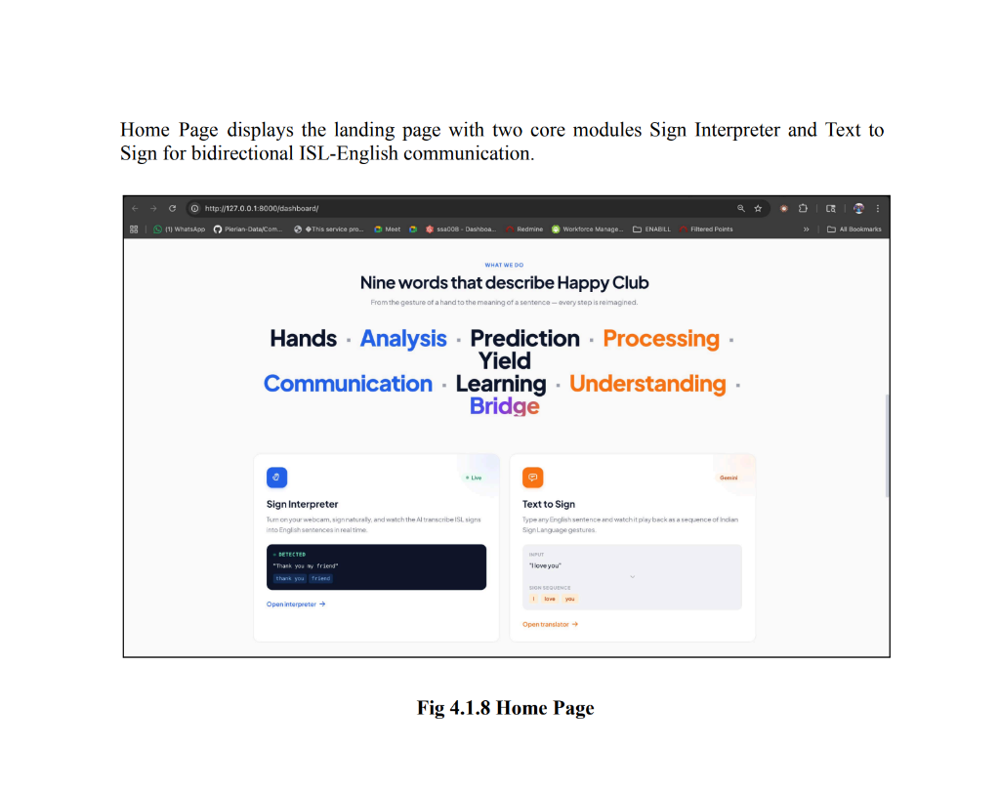

### Sign Interpreter — Live Keypoint Detection
Real-time interpretation interface with hand keypoint visualization and live English sentence output: *"Hello, how are you my friend?"*

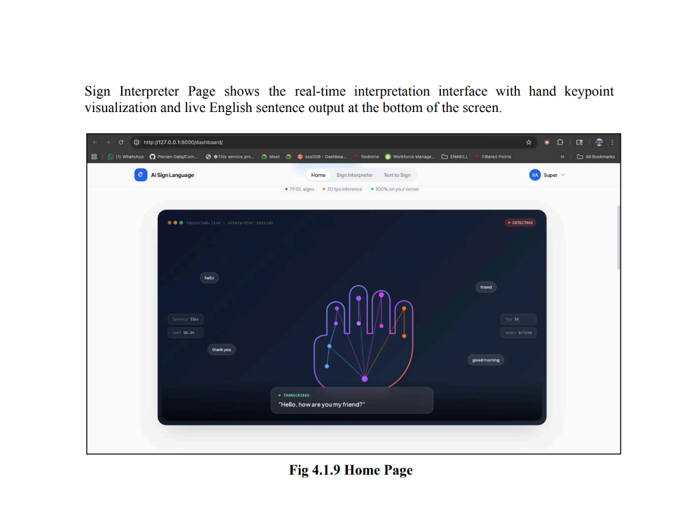

### Home Page — Pipeline
Home Page highlights the 33ms real-time pipeline — Capture, Extract, Predict, and Translate — targeting the Deaf, Interpreters, and Educators, with a call-to-action to begin interpreting or try text-to-sign.

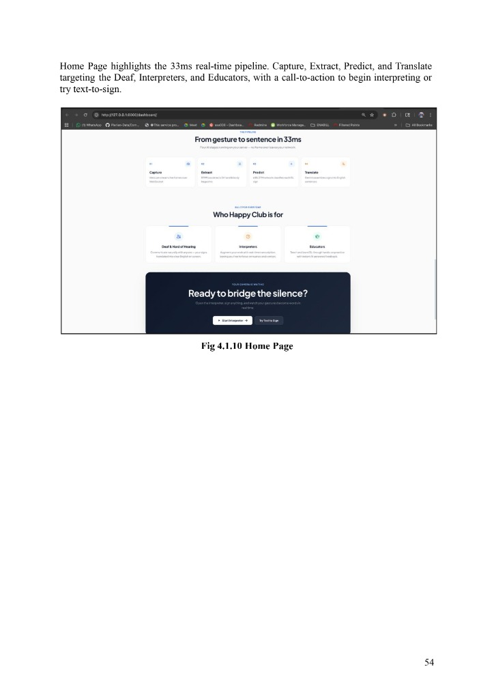

### Sign Interpreter — Real-Time Keypoint Visualization
Sign Interpreter Page shows the real-time interpretation interface with hand keypoint visualization and live English sentence output at the bottom of the screen.

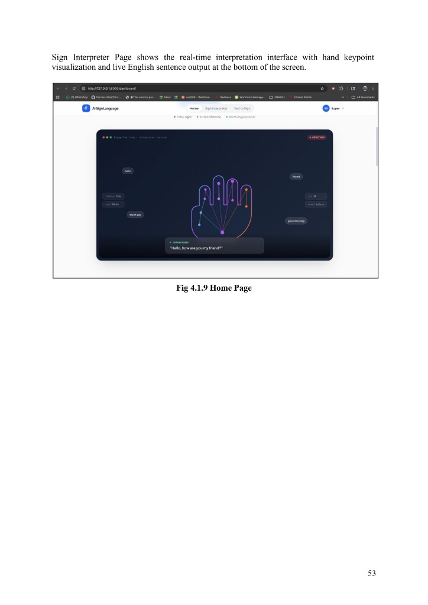

### Sign to Text
Sign Interpreter Page demonstrates the live ISL recognition interface where a user's signing is captured via webcam, with the BiLSTM model predicting the sign "Fish" at 90.2% confidence and assembling it into an English sentence in real time.

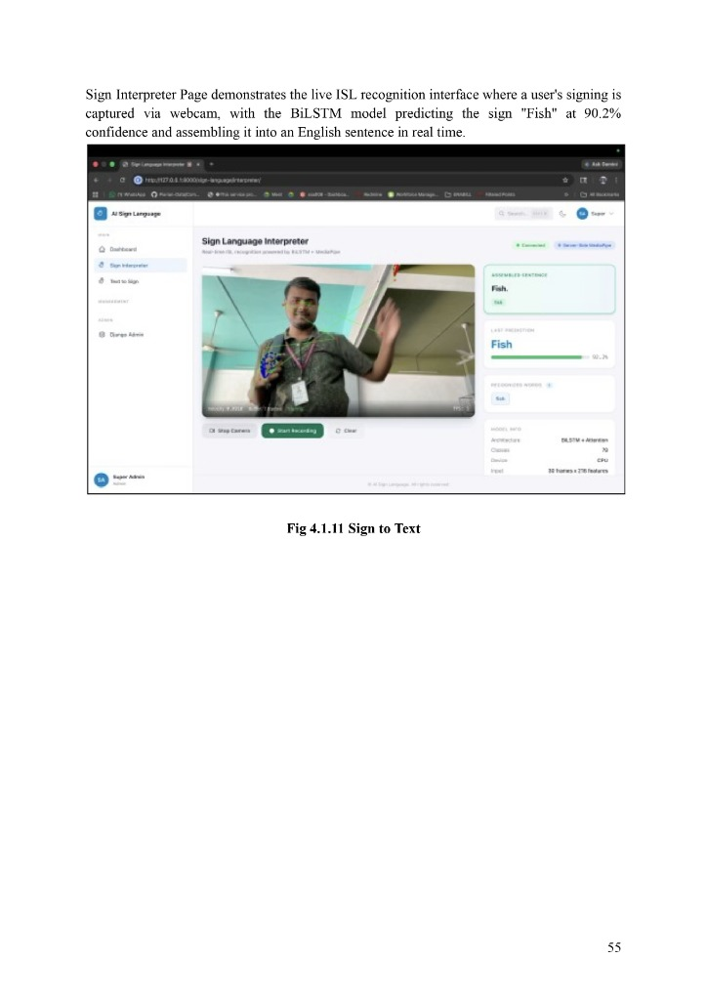

### Text to Sign
An interactive text-to-sign feature that transforms typed sentences into animated sign language sequences for better understanding and accessibility.

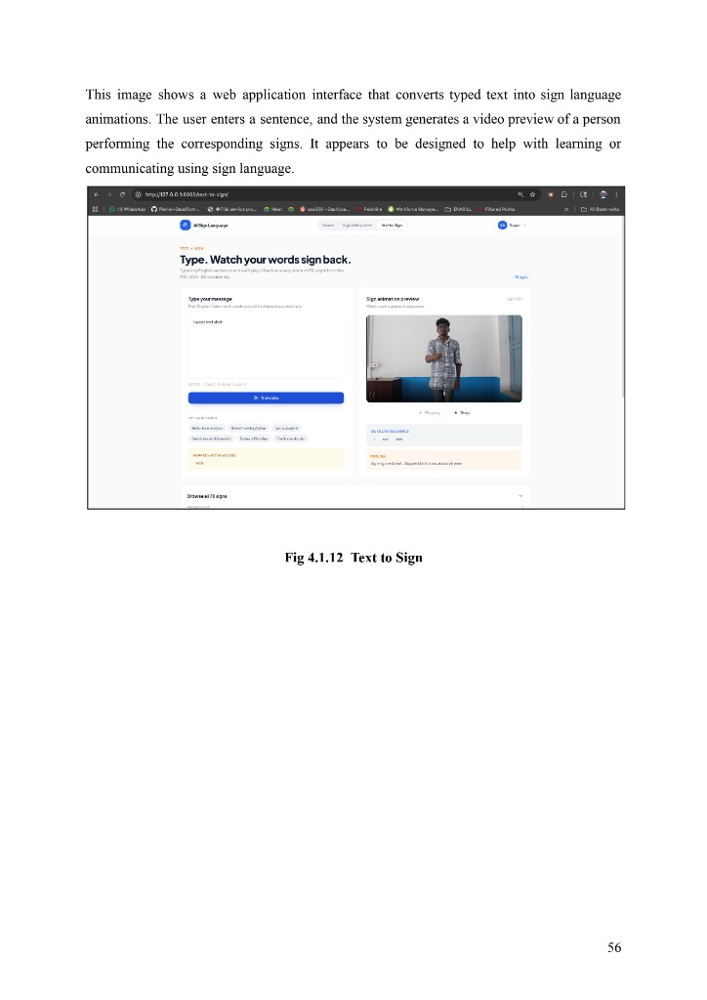

### Text to Sign & Admin Panel
Text-to-sign translation interface and Django administration panel for managing Users, Groups, and Interpretation Sessions.

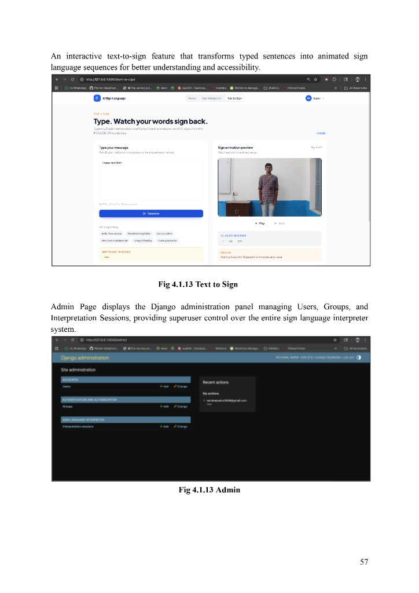

## Features
- **Real-Time Sign Detection**: Live webcam feed with RTMPose skeleton overlay and instant sign prediction
- **ISL → English Translation**: Recognized ISL glosses assembled into grammatically correct English sentences
- **Text → Sign Language**: Type English text to generate corresponding ISL sign video sequences
- **79 ISL Word Classes**: Trained on the INCLUDE dataset with 79 sign vocabulary
- **Sign Boundary Detection**: Automatic word segmentation using hand velocity-based pause detection
- **Confidence Scoring**: Only accepts predictions above 0.7 softmax confidence threshold
- **Session History**: Track and review past interpretation sessions and predictions
- **User Authentication**: Custom email login with role-based access control (RBAC)
- **Admin Panel**: Django admin for managing users, groups, and interpretation sessions
- **Dashboard**: Overview of detection sessions, recent signs, and system statistics
- **Standalone Demo**: OpenCV-based demo script for testing without Django

## Data Sources
| Dataset | Details | Type |
|---------|---------|------|
| INCLUDE ISL Dataset | 263 signs, multiple categories, video recordings | [Zenodo](https://zenodo.org/records/4010759) |
| Training Subset | 79 word classes, 1,373 test samples | Keypoint sequences (.npy) |

## Model Architecture
```
Input (30 × 216) → LayerNorm → BiLSTM (2 layers, 128 hidden) → Attention Pooling → FC(256→128) → ReLU → Dropout(0.3) → FC(128→79) → Softmax
```

| Parameter | Value | Description |
|-----------|-------|-------------|
| `SEQ_LEN` | 30 | Frames per sign (padded or uniformly sampled) |
| `FEATURE_DIM` | 108 | 54 keypoints × 2 coordinates (x, y) |
| `FEATURE_DIM_FINAL` | 216 | Position (108) + Velocity (108) |
| `HIDDEN_SIZE` | 128 | LSTM hidden units |
| `NUM_LAYERS` | 2 | Stacked BiLSTM layers |
| `NUM_CLASSES` | 79 | ISL word vocabulary |
| `VELOCITY_THRESHOLD` | 0.02 | Hand-only velocity below this = pause |
| `PAUSE_FRAMES` | 8 | Consecutive still frames to trigger word boundary |
| `MIN_SIGN_FRAMES` | 10 | Minimum frames for a valid sign segment |
| `CONFIDENCE_THRESHOLD` | 0.7 | Minimum softmax confidence to accept a prediction |

## Setup

### 1. Clone & Install
```bash
git clone https://github.com/sandeeps2004/Happy-Club-AI-Sign-Language-Translation.git
cd Happy-Club-AI-Sign-Language-Translation

python -m venv venv
source venv/bin/activate  # macOS/Linux
# venv\Scripts\activate   # Windows

pip install -r requirements.txt
```

### 2. Environment Variables
```bash
cp .env.example .env
# Edit .env — set SECRET_KEY, GEMINI_API_KEY, etc.
```

```bash
# Required
SECRET_KEY=your-secret-key-here
GEMINI_API_KEY=your-gemini-api-key    # For sentence assembly (optional — falls back to rule-based)

# Optional
DEBUG=True
ALLOWED_HOSTS=localhost,127.0.0.1
TIME_ZONE=UTC
```

### 3. Database
```bash
python manage.py migrate
python manage.py createsuperuser
```

### 4. AI Model
```bash
# Option A: Download INCLUDE dataset and train
python ai/setup_dataset.py --download --extract
python ai/train.py --epochs 50

# Option B: Use pre-trained checkpoint
# Place isl_lstm_best.pt in ai/checkpoints/
```

### 5. Run
```bash
# Development server (Daphne ASGI — required for WebSocket support)
python manage.py runserver

# Or with Daphne directly
daphne -b 0.0.0.0 -p 8000 config.asgi:application
```

Open [http://localhost:8000](http://localhost:8000) and navigate to the Sign Language Interpreter.

### 6. Standalone Demo (No Django)
```bash
python ai/demo.py
```

Runs a real-time OpenCV window with live landmark overlay and sign detection — useful for testing the AI pipeline without the web server.

## Project Structure
```
├── ai/
│   ├── core/
│   │   ├── assembler.py          # ISL gloss → English sentence (Gemini + fallback)
│   │   ├── constants.py          # All hyperparameters & thresholds (single source of truth)
│   │   ├── detector.py           # Sign boundary detector (velocity-based segmentation)
│   │   ├── extractor.py          # RTMPose keypoint extraction (54 keypoints × 2 coords)
│   │   ├── model.py              # BiLSTM + Attention classifier (thread-safe singleton)
│   │   └── preprocessing.py      # Normalization, velocity features, hand velocity
│   ├── checkpoints/              # Trained model weights (.pt files)
│   ├── data/                     # INCLUDE dataset (keypoint .npy files)
│   ├── charts/                   # Training visualization outputs
│   ├── train.py                  # Training script (INCLUDE-50 dataset)
│   ├── setup_dataset.py          # Download & extract INCLUDE ISL dataset from Zenodo
│   ├── demo.py                   # Standalone OpenCV demo (no Django)
│   ├── visualize.py              # Training metrics visualization
│   └── config.py                 # AI-specific config
├── apps/
│   ├── accounts/                 # Custom User model, email auth, registration, profile
│   ├── core/                     # Dashboard, middleware, logging, base models, template tags
│   └── sign_language/
│       ├── consumers.py          # WebSocket consumer (frame processing + inference)
│       ├── inference.py          # Thin import layer from ai/core/
│       ├── models.py             # InterpretationSession & Prediction (DB persistence)
│       ├── routing.py            # WebSocket URL routing
│       ├── views.py              # Interpreter page view
│       └── admin.py              # Django admin registration
├── config/
│   ├── settings.py               # Main settings (reads from .env)
│   ├── urls.py                   # Root URL configuration
│   ├── asgi.py                   # ASGI application (HTTP + WebSocket routing)
│   └── wsgi.py                   # WSGI fallback
├── templates/
│   ├── layouts/                  # Base templates (base.html, auth_base.html)
│   ├── sign_language/            # Interpreter UI (Alpine.js + Canvas landmark drawing)
│   ├── accounts/                 # Login, register, profile, password reset
│   ├── core/                     # Dashboard, 404, 500
│   ├── includes/                 # Sidebar, topbar, pagination, command palette
│   └── components/              # Reusable UI components
├── services/                     # Service layer (email, etc.)
├── static/                       # Static assets (JS, CSS)
├── tests/                        # Test suite
├── media/                        # User uploads
├── requirements.txt              # Python dependencies
├── manage.py                     # Django management
└── .env.example                  # Environment variable template
```

## WebSocket Protocol

### Client → Server
```json
{"type": "frame", "image": "<base64_jpeg>"}
{"type": "start_recording"}
{"type": "stop_recording"}
{"type": "clear"}
```

### Server → Client
```json
{"type": "model_info", "num_classes": 79, "glosses": [...], "device": "cpu"}
{"type": "frame_result", "landmarks": {...}, "status": {...}, "prediction": {...}}
{"type": "prediction", "word": "hello", "confidence": 0.95, "buffer": ["hello"]}
{"type": "sentence", "text": "Hello, how are you?", "glosses": ["hello", "how", "you"]}
{"type": "recording_started"}
{"type": "recording_stopped"}
{"type": "cleared"}
{"type": "error", "message": "..."}
```

## Testing
```bash
pytest tests/
```

| Test | Result |
|------|--------|
| WebSocket connection | < 200ms |
| Frame latency (1000 frames) | Drop rate 0.8%, avg 38ms |
| RTMPose keypoint count | 54 KPs detected consistently |
| RTMPose PCK accuracy | 93.4% |
| RTMPose inference speed | 22ms/frame |
| BiLSTM Top-1 accuracy | 91.2% |
| Gemini BLEU score | 38.7 |

## License
MIT License — see [LICENSE](LICENSE) for details.
